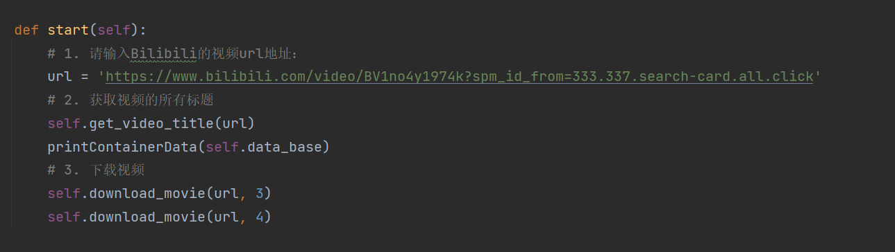
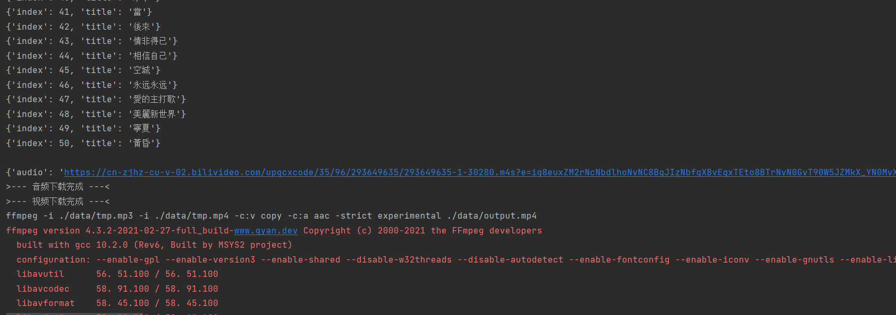
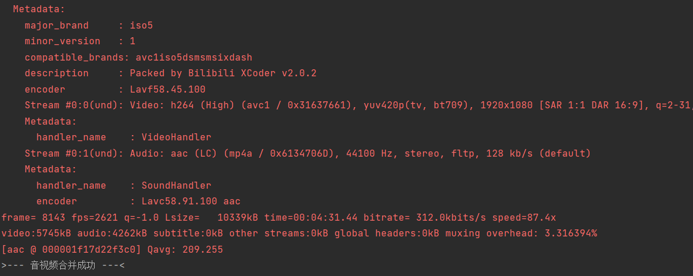
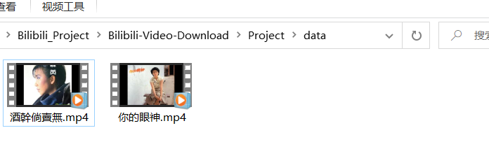

## 1. About Bilibili-Video-Download

- 提供一个URL，即可获取该URL地址下包括选集的视频。
- 直接提供源代码，可以根据自己的需要选择下载某个视频。
- 该程序需要将音频和视频合并，用到了**FFmpeg**
  - **FFmpeg**路径添加到了环境变量中。
  - 没有**FFmpeg**，无法使用该程序。
- 如果你已经下载了该视频，该程序默认不会再次下载该视频。
- 需要在与**main.py**同级的目录下创建**data**文件夹
  - 否则，无法进行下载。

## 2. 配置项

- 视频的URL地址
- Cookie(可选)
  - 可以不添加

## 3. Demo（部分截图）

